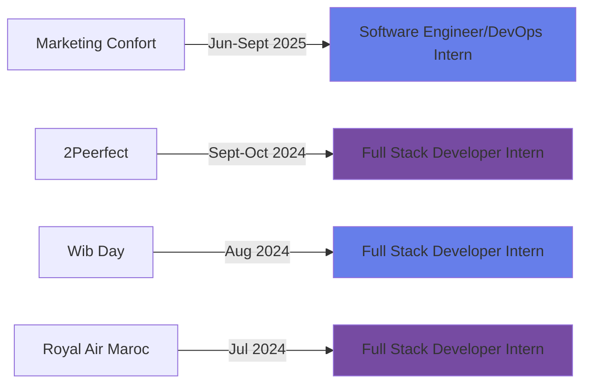

<div align="center">
  
</div>

<div align="center">
  
  [](https://git.io/typing-svg)
  
</div>

<div align="center">
  
  [](https://www.linkedin.com/in/oussama-lakrafi-118805295/)
  [](https://github.com/craxelfn)
  [](mailto:oussamaa1lakrafi@gmail.com)
  
</div>

<br/>


### 👨‍💻 About Me

🎓 **Computer Science Engineering Student** @ ENSA Berrechid

💼 **Software & DevOps Engineer** with passion for building scalable solutions

🚀 Specialized in **Microservices**, **DevOps**, and **AI-driven applications**


🎯 Exploring **Generative AI**, **Cloud Architecture**, and **Real-time Systems**

📍 Based in **Casablanca, Morocco**

<br clear="right"/>

---


## 🛠️ Tech Arsenal

<div align="center">

### 💻 Languages


### 🎨 Frontend Development


### ⚙️ Backend Development


### 🗄️ Databases


### ☁️ DevOps & Cloud


### 🤖 AI & Data Science


</div>


## 🏆 Certifications & Achievements

<div align="center">

| Certification | Issuer | Year |
|--------------|--------|------|
| 🥇 **Oracle Cloud Infrastructure DevOps Professional** | Oracle | 2025 |
| ☕ **Oracle Certified Professional: Java SE 17 Developer** | Oracle | 2024 |
| ☁️ **AWS Certified Cloud Practitioner** | AWS | 2025 |
| 🤖 **OCI Generative AI Professional** | Oracle | 2025 |
| 🗄️ **Oracle Database SQL Associate** | Oracle | 2025 |
| 🐍 **Python Programmer Bootcamp** | 365 Data Science | 2024 |

</div>


## 🚀 Featured Projects

<div align="center">

<table>
<tr>
<td width="50%">

### 🏥 Healthcare Platform
  
**AI-powered medical consultation system**

- 🎥 Real-time video consultations (WebRTC)
- 🤖 AI chatbot with Generative AI
- 📅 Smart appointment management
- 🔐 QR code prescriptions
- 📊 RNN-based feedback moderation

**Stack:** Next.js • Spring Boot • PostgreSQL • MongoDB • Kafka • Docker

</td>
<td width="50%">

### 🛍️ Real-Time Auction Platform

**Live bidding marketplace**

- ⚡ WebSocket real-time bidding
- 🔔 Instant notifications
- 📈 Bid trend analytics
- 🔒 JWT authentication
- 📊 Interactive charts

**Stack:** Spring Boot • Next.js • PostgreSQL • STOMP.js • Material UI

</td>
</tr>

<tr>
<td width="50%">

### 👥 Employee Management System

**Complete HR & collaboration solution**

- 📹 Video conferencing (WebRTC)
- 💬 Real-time messaging (Socket.IO)
- 👔 Department & task management
- 🔐 Role-based access control
- 📊 Performance tracking

**Stack:** React • Node.js • MongoDB • WebRTC • Socket.IO

</td>
<td width="50%">

### ☁️ Three-Tier Web App (GitOps)

**Production-ready cloud deployment**

- 🚀 AWS EKS with Terraform
- 🔄 CI/CD with Jenkins & ArgoCD
- 📊 Monitoring (Prometheus/Grafana)
- 🛡️ SonarQube code quality
- 🎯 Helm chart management

**Stack:** Terraform • AWS • Kubernetes • Jenkins • ArgoCD

</td>
</tr>
</table>

</div>


## 📊 GitHub Analytics

<div align="center">
  
  
</div>

<div align="center">
  
</div>

<div align="center">
  
</div>


## 🏅 GitHub Trophies

<div align="center">
  
</div>


## 💼 Experience Highlights

<div align="center">



</div>


## 🌟 What I'm Working On

```javascript
const oussama = {
    currentFocus: "AI Homework Assistant & Healthcare Platform",
    learning: ["Generative AI", "Advanced DevOps", "Microservices Architecture"],
    technologies: {
        frontend: ["Next.js", "React Native", "React js"],
        backend: ["Spring Boot", "Node.js", "Microservices"],
        devops: ["Kubernetes", "ArgoCD", "GitLab CI/CD", "Terraform"],
        ai: ["Generative AI", "TensorFlow"],
        databases: ["PostgreSQL", "MongoDB", "MySQL"]
    },
    certifications: ["Oracle DevOps", "AWS Cloud", "OCI Gen AI", "Java SE 17"],
    askMeAbout: ["Web Dev", "Cloud Architecture", "DevOps", "AI Integration"],
    funFact: "I turn coffee into scalable microservices ☕️ → 🚀"
};
```


## 📫 Let's Connect!

<div align="center">
  
I'm always excited to collaborate on innovative projects and discuss cutting-edge technologies!

[](https://www.linkedin.com/in/oussama-lakrafi-118805295/)
[](mailto:oussamaa1lakrafi@gmail.com)
[](https://github.com/craxelfn)

<br/>

### 💭 *"Building the future, one commit at a time"* 💻✨

<br/>


</div>


