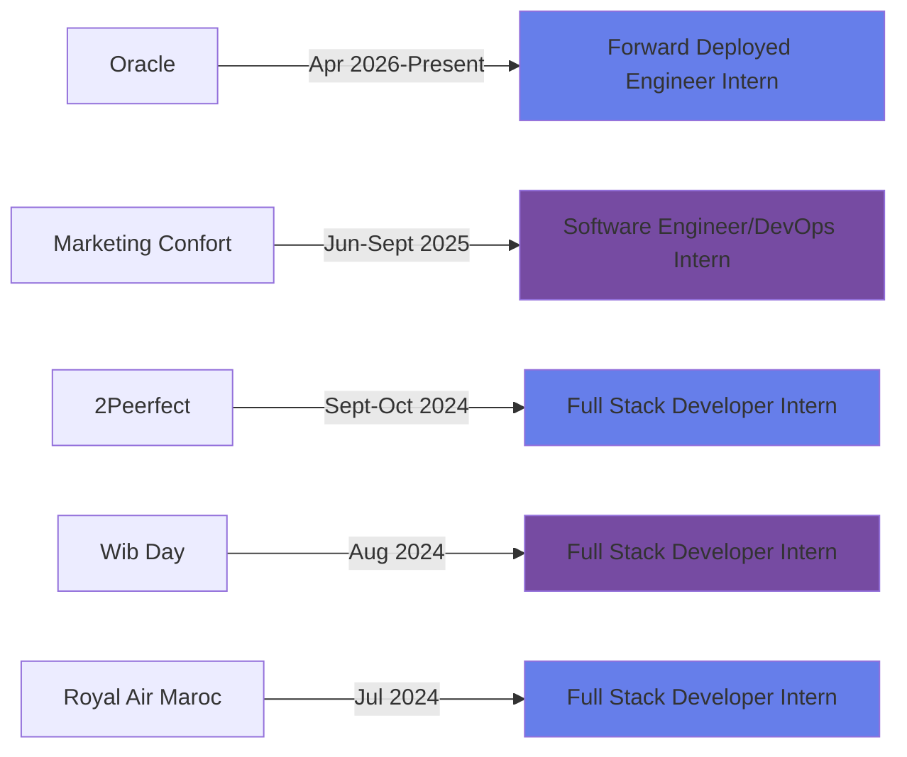

<div align="center">
  
</div>

<div align="center">

  [](https://git.io/typing-svg)

</div>

<div align="center">

  [](https://www.linkedin.com/in/oussama-lakrafi-118805295/)
  [](https://github.com/craxelfn)
  [](mailto:oussamaa1lakrafi@gmail.com)

</div>

<br/>


### 👨‍💻 About Me

- 💼 **Forward Deployed Engineer (FDE) Intern** @ **Oracle** — building AI-driven data engineering solutions on Oracle AI Data Platform
- 🤖 Working on **agentic AI workflows**, **conversational automation**, and **production data pipelines** (Medallion / Delta Lake)
- 🎓 **Computer Science Engineering Student** @ ENSA Berrechid *(Engineer's Degree — Master equivalent, 2026)*
- 🚀 Background in **microservices**, **DevOps**, and **full-stack development**
- 🎯 Exploring **Generative AI**, **distributed systems**, and **real-time data platforms**
- 📍 Based in **Casablanca, Morocco**

<br clear="right"/>

---


## 🛠️ Tech Arsenal

<div align="center">

### 💻 Languages


### 📊 Data & AI


### ☁️ DevOps & Cloud


### ⚙️ Backend


### 🎨 Frontend


### 🗄️ Databases


</div>


## 🏆 Certifications & Achievements

<div align="center">

| Certification | Issuer | Year |
|--------------|--------|------|
| 🥇 **Oracle Cloud Infrastructure DevOps Professional** | Oracle | 2025 |
| 🤖 **OCI Generative AI Certified Professional** | Oracle | 2025 |
| ☕ **Oracle Certified Professional: Java SE 17 Developer** | Oracle | 2024 |
| ☁️ **AWS Certified Cloud Practitioner** | AWS | 2025 |
| 🗄️ **Oracle Database SQL Certified Associate** | Oracle | 2025 |
| 🐍 **Python Programmer Bootcamp** | 365 Data Science | 2025 |

</div>


## 🚀 Featured Projects

<div align="center">
<table>
<tr>
<td width="50%">

### 🏥 Healthcare Platform

**AI-powered medical consultation system**

- 🎥 Real-time video consultations (WebRTC)
- 🤖 AI chatbot with Generative AI
- 📅 Smart appointment management
- 🔐 QR code prescriptions
- 📊 RNN-based feedback moderation

**Stack:** Next.js • Spring Boot • PostgreSQL • MongoDB • Kafka • Docker

</td>
<td width="50%">

### 📡 Real-Time Health Monitoring

**Event-driven data platform**

- ⚡ Kafka event pipeline with stateless Python microservices
- 🧠 ML inference & anomaly detection
- 🔔 Real-time alerting
- 📊 Live Next.js dashboards (WebSocket)
- ☁️ S3/Athena analytics pipelines

**Stack:** Kafka • Python • Next.js • AWS • Redis • Kubernetes

</td>
</tr>
<tr>
<td width="50%">

### ☁️ Three-Tier Web App (GitOps)

**Production-ready cloud deployment**

- 🚀 AWS EKS with Terraform
- 🔄 CI/CD with Jenkins & ArgoCD
- 📊 Monitoring (Prometheus/Grafana)
- 🛡️ SonarQube code quality
- 🎯 Helm chart management

**Stack:** Terraform • AWS • Kubernetes • Jenkins • ArgoCD

</td>
<td width="50%">

### 🛍️ Real-Time Auction Platform

**Live bidding marketplace**

- ⚡ WebSocket real-time bidding
- 🔔 Instant notifications
- 📈 Bid trend analytics
- 🔒 JWT authentication
- 📊 Interactive charts

**Stack:** Spring Boot • Next.js • PostgreSQL • STOMP.js • Material UI

</td>
</tr>
</table>
</div>


## 📊 GitHub Analytics

<div align="center">
  
  
</div>

<div align="center">
  
</div>

<div align="center">
  
</div>


## 🏅 GitHub Trophies

<div align="center">
  
</div>


## 💼 Experience Highlights

<div align="center">


```mermaid
graph LR
    A[Oracle] -->|Apr 2026-Present| B[Forward Deployed Engineer Intern]
    C[Marketing Confort] -->|Jun-Sept 2025| D[Software Engineer/DevOps Intern]
    E[2Peerfect] -->|Sept-Oct 2024| F[Full Stack Developer Intern]
    G[Wib Day] -->|Aug 2024| H[Full Stack Developer Intern]
    I[Royal Air Maroc] -->|Jul 2024| J[Full Stack Developer Intern]

    style B fill:#667eea
    style D fill:#764ba2
    style F fill:#667eea
    style H fill:#764ba2
    style J fill:#667eea
```

</div>


## 🌟 What I'm Working On

```python
class Oussama:
    role          = "Forward Deployed Engineer Intern @ Oracle"
    current_focus = ["AI Data Platform solutions", "Agentic data-engineering workflows"]
    learning      = ["Advanced Spark & Delta Lake", "Agentic AI / MCP", "Data governance at scale"]

    stack = {
        "data":     ["Spark", "Delta Lake", "Airflow", "dbt", "Kafka", "Medallion Architecture"],
        "ai":       ["Generative AI", "Agentic AI", "MCP", "ML pipelines"],
        "devops":   ["Kubernetes", "Terraform", "ArgoCD", "GitLab CI/CD"],
        "cloud":    ["OCI", "AWS"],
        "backend":  ["Python", "Spring Boot", "Node.js"],
    }

    ask_me_about = ["Data Engineering", "DevOps", "Cloud Architecture", "AI Integration"]
    fun_fact     = "I turn coffee into data pipelines ☕️ → 🚀"
```


## 📫 Let's Connect!

<div align="center">

I'm always excited to collaborate on data engineering, AI, and cloud projects!

[](https://www.linkedin.com/in/oussama-lakrafi-118805295/)
[](mailto:oussamaa1lakrafi@gmail.com)
[](https://github.com/craxelfn)

<br/>

### 💭 *"Building the future, one pipeline at a time"* 📊✨

<br/>


</div>


